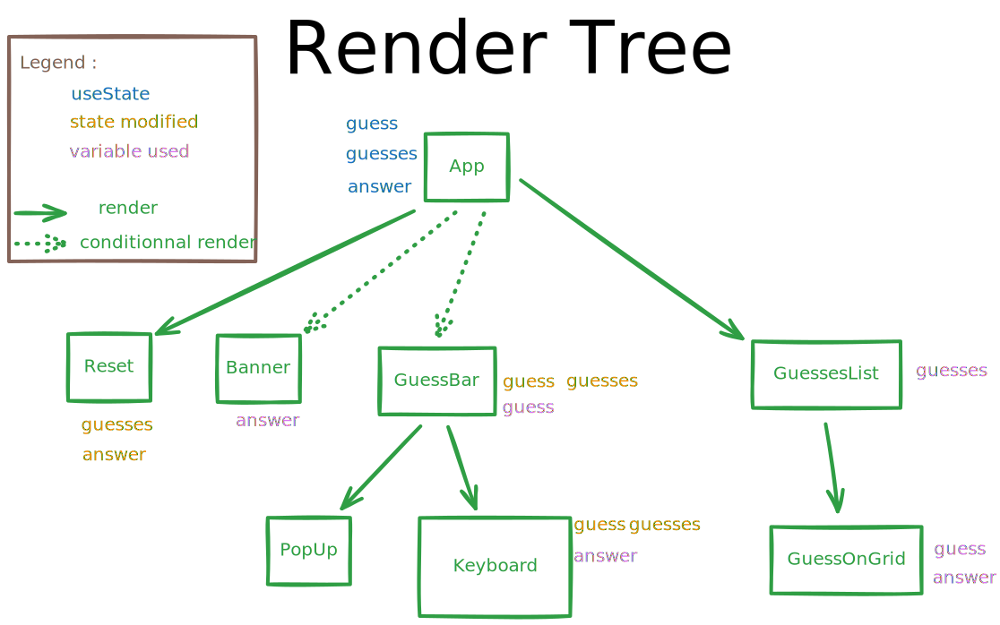

# wordle clone
A wordle clone, done with React. [Live here on Vercel](wordle-nu-ebon.vercel.app)

- <a href="#render-tree">Render Tree</a>
- [Usage](#usage)
- [Building](#building)
    - [build from source](#build-from-source)
    - [create an docker image](#create-an-docker-image)


-- --      

<h3 id="render-tree"></h3>  <!-- only way I found to reference an image in table of content  -->



-- --

# Usage
* A live version is available [here on Vercel](wordle-nu-ebon.vercel.app)
* Can be run with docker :
    ```sh
        docker run -d -P --rm --name wordle-clone ghcr.io/merwanel/wordle:latest
    ``` 
    Then do `docker ps` to see which port to look at  

# Building
#### build from source

```sh
    git clone git@github.com:Merwanel/wordle.git
    cd wordle
    npm install
    npm build
```
Then `npm start` to run

#### create an docker image 
```sh
    git clone git@github.com:Merwanel/wordle.git
    cd wordle
    docker build -t wordle:latest .
```
Then `docker run -d -P --rm --name wordle-clone wordle:latest` to run
And `docker ps` to see the port mapping  
